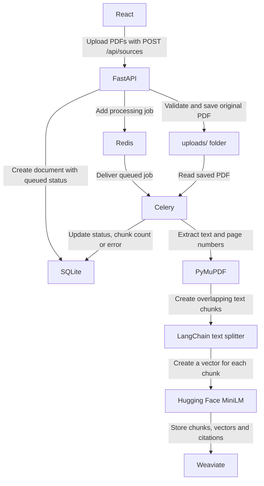
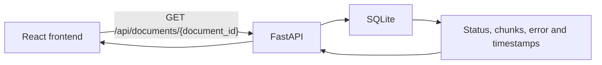
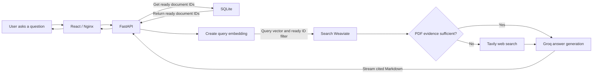

# Corrective RAG (CRAG) with hybrid evidence sources.

An end-to-end research assistant that ingests user-supplied PDFs, indexes them in a vector database, retrieves relevant evidence, optionally supplements weak local evidence with web search, and streams a cited Markdown answer to a React frontend.

The project demonstrates asynchronous document ingestion,advanced retrieval-augmented generation, adaptive source selection, citations, temporary conversation memory, and containerized deployment.

## Project documentation

- [API reference and end-to-end processing](API_REFERENCE.md)
- [Contribution, security and pull-request guide](CONTRIBUTING.md)
- [Application screenshots](SCREENSHOTS.md)

## Repository structure

```text
Document_retreiver/
├── backend/
│   ├── agents/                 # Adaptive research orchestration
│   ├── models/                 # API response schemas
│   ├── repositories/           # SQLite metadata access
│   ├── rest/                   # Source and research endpoints
│   ├── services/               # PDF, embedding, retrieval, web and Weaviate services
│   ├── tasks/                  # Celery document-processing task
│   ├── celery_app.py
│   ├── config.py
│   └── main.py
├── frontend/                   # React/Vite UI and Nginx configuration
├── tests/                      # Unit and API tests
├── API_REFERENCE.md            # Workflows, endpoints and error behavior
├── CONTRIBUTING.md             # Contribution, security and review standards
├── uploads/                    # Original PDFs; shared with Celery
├── data/                       # SQLite database
├── Dockerfile.backend
├── compose.yaml
├── pyproject.toml
└── uv.lock
```

## Technology stack

| Layer | Technology | Responsibility |
|---|---|---|
| Frontend | React, TypeScript, Vite | Uploads, processing status, requests and streamed output |
| API | FastAPI | Validation, REST endpoints and streaming |
| Queue | Redis, Celery | Asynchronous PDF processing |
| Database | SQLite | Document metadata and processing-state records |
| Extraction | PyMuPDF | Page-level PDF text extraction |
| Chunking | LangChain text splitters | Overlapping text chunks |
| Embeddings | Sentence Transformers | Document and query vectors |
| Vector database | Weaviate | Chunk vectors, text and citation metadata |
| LLM | Groq | Evidence grading and answer generation |
| External source | Tavily | Web fallback when local evidence is insufficient |
| Production frontend | Nginx | Static frontend and streaming API proxy |

## Architecture

### PDF upload and indexing



The `uploads/` box is the local PDF storage folder, normally `uploads/default/`. The upload request returns HTTP `202` after queueing. Celery performs extraction, chunking, embedding, and Weaviate storage in the background while SQLite tracks progress.

### Document status lookup



The frontend polls this endpoint every two seconds while a document is processing. This lookup reads SQLite metadata only; it does not query Weaviate. Polling stops when the document reaches `ready` or `failed`.

### Research and answer generation



Research first asks SQLite which uploaded documents are ready. FastAPI then uses those document IDs as a filter when searching Weaviate, preventing queued, processing or failed documents from being searched. Tavily is used only when Groq determines that the retrieved PDF evidence is insufficient. SQLite contributes readiness and operational metadata; Weaviate supplies the research text and page citations.

### Storage responsibilities

| Storage | Content |
|---|---|
| `uploads/` | Original PDF bytes |
| SQLite | Filename, storage path, task ID, size, status, errors, chunk count and timestamps |
| Weaviate | Chunk text, vectors, document ID, filename, page and chunk position |
| Redis | Temporary Celery task messages and results |
| React state | Temporary six-message conversation memory; cleared on refresh |

One PDF creates one SQLite document row and multiple Weaviate chunk objects. The shared `document_id` connects the database record to its vector objects. 

## Design rationale

- **Celery and Redis** keep expensive PDF extraction and embedding outside API request latency.
- **SQLite** provides simple durable lifecycle metadata for a single-host technical demonstration.
- **Weaviate self-provided vectors** ensure document and query embeddings use the same controlled local model.
- **Adaptive web fallback** avoids unnecessary external search when uploaded evidence is sufficient.
- **StreamingResponse and Groq `astream`** minimize time to visible output.
- **Temporary React memory** supports follow-up questions without introducing persistent personal conversation storage.

## Prerequisites

### Local development

- Python 3.12 or later.
- `uv` package manager.
- Node.js 22 and npm.
- Reachable Redis server.
- Reachable Weaviate server with HTTP ports.
- Groq API key.
- Optional Tavily API key.

## Configuration

The .env contains credentials and deployment-specific addresses.

Example configuration:

```env
CORS_ORIGINS=http://localhost:5173,http://127.0.0.1:5173
UPLOAD_ROOT=/absolute/path/to/Document_retreiver/uploads
METADATA_DB_PATH=/absolute/path/to/Document_retreiver/data/documents.sqlite3
MAX_UPLOAD_BYTES=26214400
DEFAULT_COLLECTION_ID=default

CELERY_BROKER_URL=redis://REDIS_HOST:6379/0
CELERY_RESULT_BACKEND=redis://REDIS_HOST:6379/1

WEAVIATE_HTTP_HOST=WEAVIATE_HOST
WEAVIATE_HTTP_PORT=8080
WEAVIATE_HTTP_SECURE=false
WEAVIATE_GRPC_HOST=WEAVIATE_HOST
WEAVIATE_GRPC_PORT=50051
WEAVIATE_GRPC_SECURE=false
WEAVIATE_COLLECTION=DocumentChunk

EMBEDDING_MODEL=sentence-transformers/all-MiniLM-L6-v2
CHUNK_SIZE=800
CHUNK_OVERLAP=100

GROQ_API_KEY=replace_with_a_real_groq_key
GROQ_MODEL=llama-3.3-70b-versatile

TAVILY_API_KEY=replace_with_a_real_tavily_key
RETRIEVAL_LIMIT=8
RETRIEVAL_MAX_DISTANCE=0.65
WEB_SEARCH_RESULTS=3
```

`HF_TOKEN` is not required for the public default embedding model. It is optional for private/gated models or increased Hugging Face Hub limits. The model is downloaded on first use unless already cached.

Redis database `/0` is used for task messages and `/1` for short-lived task results. Permanent processing status remains in SQLite.

## Local setup and execution

### 1. Install backend dependencies

```bash
cd /path/to/Document_retreiver
uv sync
```

### 2. Install frontend dependencies

```bash
cd frontend
npm ci
cd ..
```

### 3. Configure the local frontend API address

Create `frontend/.env.local`:

```env
VITE_API_BASE_URL=http://localhost:8787
```

Use the backend server's reachable IP instead of `localhost` when the browser runs on another machine.

### 4. Start FastAPI

From the repository root:

```bash
uv run uvicorn backend.main:app --host 0.0.0.0 --port 8787 --reload
```

Verify:

```bash
curl http://localhost:8787/health
```

Expected response:

```json
{"status":"ok"}
```

Interactive API documentation is available at `http://localhost:8787/docs`.

### 5. Start the Celery worker

In a second terminal, from the repository root:

```bash
uv run celery -A backend.celery_app.celery_app worker --loglevel=info --concurrency=1
```

Concurrency `1` intentionally limits simultaneous model copies and memory usage. Increase it only after measuring available CPU/RAM/GPU capacity.

### 6. Start the frontend

In a third terminal:

```bash
cd frontend
npm run dev -- --host 0.0.0.0
```

Open `http://localhost:5173`.

## Testing

Run the complete suite:

```bash
uv run pytest tests -vv
```

## Docker deployment

The Docker deployment uses three services:

- `frontend`: Compiled React application, published on host port `5173`.
- `api`: FastAPI on internal Docker port `8787`.
- `worker`: Celery using the same backend image as the API.

## Example research queries and expected behavior

### Document-grounded formula question

Query:

```text
What is the Duration Score formula, and what do its variables mean?
```

Expected behavior:

- Retrieve relevant PDF chunks.
- Explain the formula using only supplied evidence.
- Cite the correct filename and one-based PDF page.
- Include the document's size, processing status, chunk count and timestamps.

### Follow-up question

First query:

```text
Explain how the system uses Intersection over Union.
```

Follow-up:

```text
What are its limitations?
```

Expected behavior: use temporary conversation context to resolve “its”, retrieve fresh evidence, and cite that evidence rather than treating the previous answer as a source.

### External-source fallback

Query:

```text
Compare the uploaded report with current industry guidance.
```

Expected behavior: if PDF evidence alone is insufficient, add Tavily results, distinguish web sources from PDFs, and cite source URLs.

## Current limitations and planned improvements

### Document ingestion

- **Limited file-format support:** The application currently accepts only PDF files. Future versions could support DOCX, TXT, HTML and other commonly used document formats.
- **No OCR support:** Scanned and image-based PDFs cannot be searched because they contain no extractable text. An OCR pipeline could be added.
- **Document lifecycle management:** Document deletion, replacement and versioning are not fully supported. Reprocessing a document should remove obsolete chunks and vectors before storing the new version.
- **Scalable file storage:** Uploaded files are stored on the local filesystem. Production deployments should use shared object storage.

### Retrieval and answer quality

- **Improved corrective workflow:** The workflow already performs evidence relevance grading, but could add query rewriting, post-generation groundedness checking, answer-usefulness grading and bounded retries.
- **Reranking:** A cross-encoder or LLM-based reranker could reorder retrieved chunks and remove results that share broad keywords but do not directly answer the question.
- **Model evaluation:** Stronger embedding, reranking and generation models should be evaluated using measurable quality, latency, privacy and cost criteria. 
- **Source-quality filtering:** External search results should prioritize authoritative and primary sources, consider publication dates and remove low-quality or duplicate results.
- **Claim verification:** Important factual claims could be checked against multiple independent sources before being included in an answer.
- **Temporal query handling:** Questions containing terms such as “today,” “latest” or “this week” could use date-aware query rewriting and prioritize current web evidence.
- **Citation validation:** A post-generation step could verify that each citation genuinely supports its associated claim.

### Storage and user isolation

- **Scalable metadata storage:** SQLite is appropriate for a single-host demonstration, but PostgreSQL or another managed relational database would better support concurrent users, migrations, backups, replication and high availability.
- **Collection isolation:** The frontend currently uses one shared `collection_id`. Production should create separate collections or access-control scopes for each user, organization or session.
- **Persistent conversation memory:** Conversation history is stored temporarily in React state and is cleared when the page refreshes. Production could store conversations securely and associate them with authenticated users.
- **Retention controls:** Users should be able to view and delete their documents, conversations and associated vector data. Automatic retention and expiration policies should also be considered.

### Performance and background processing

- **Caching:** The embedding model is cached in process memory, but query embeddings, retrieval results, web searches and model responses are not cached. Redis caching could reduce repeated work, with invalidation when documents are added, changed or removed.
- **Worker concurrency:** Celery currently uses one worker process to control embedding-model memory usage. Production could use multiple workers, autoscaling and separate queues for different task types.
- **Task reliability:** Background tasks could include retry policies, timeout handling, dead-letter queues, idempotency and administrative reprocessing controls.
- **Parallel processing:** Upload processing already runs asynchronously through Celery, but the default worker concurrency is one. Production could process independent documents across multiple workers while respecting model-memory and external API limits.
- **Model optimization:** Embeddings are already generated in batches. Production could tune batch sizes, pre-warm the embedding model and use optional GPU acceleration to reduce document-processing latency.

### Frontend experience

- **Persistent status display:** Successful ingestion cards currently disappear shortly after completion. Production should retain document status in a manageable document library.
- **Rendered Markdown:** Streamed Markdown is displayed as source text. A production frontend should render it safely with support for headings, lists, code blocks and clickable citations.
- **Conversation management:** The interface could support saved conversations, conversation titles, search and deletion.
- **Upload controls:** The frontend could provide cancellation, retry, progress indicators and clearer explanations for failed uploads.

### Security and privacy

- **Authentication and authorization:** The application currently has no user accounts or document-level access control. Production requires authentication, authorization and tenant isolation.
- **File security:** Basic PDF extension, signature and size validation is implemented. Production should add malware scanning, deeper file inspection and sandboxed document processing.
- **API protection:**  Request length, conversation-history and upload-size limits are already implemented. Production should add rate limiting, per-user quotas and abuse detection.
- **Prompt-injection protection:** Retrieved documents and web pages must continue to be treated as untrusted content. Additional filtering and output validation could reduce indirect prompt-injection risks.
- **Secret management:** API keys should be stored in a managed secret service instead of plain environment files in production.
- **Data protection:** Sensitive data should be encrypted in transit and at rest, with appropriate audit logs and privacy controls.

### Monitoring and reliability

- **Dependency-aware health checks:** The current health endpoint checks only whether FastAPI is running. Production health checks should verify Redis, Weaviate, Celery workers, storage and required model providers.
- **Observability:** Add structured logs, metrics, distributed tracing and alerts for request failures, queue length, processing duration, retrieval latency and time to first token.
- **Cost monitoring:** Track embedding, LLM and web-search usage to detect unexpected costs and support per-user quotas.
- **Backup and recovery:** Add automated database and file-storage backups, recovery testing and documented disaster-recovery procedures.

### Testing and evaluation

- **External integration testing:** The current unit suite mocks external services. Add integration tests using real Redis, Weaviate, Groq and Tavily test environments.
- **Frontend and end-to-end testing:** Add component tests, browser-based workflow tests and streaming-response tests.
- **Load testing:** Measure concurrent uploads, research requests, queue throughput, memory consumption and response latency.
- **Evaluation dataset:** Create a fixed set of documents, questions, expected evidence and reference answers.
- **Quality metrics:** Evaluate retrieval recall and precision, citation correctness, groundedness, answer relevance, web-fallback accuracy, latency and cost.
- **Human evaluation:** Review answers for usefulness, clarity, completeness and factual accuracy, especially for questions that combine uploaded and external evidence.

