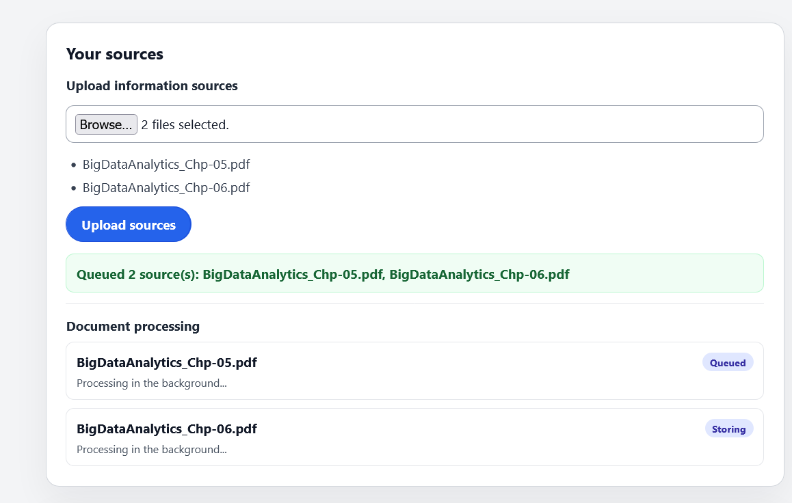
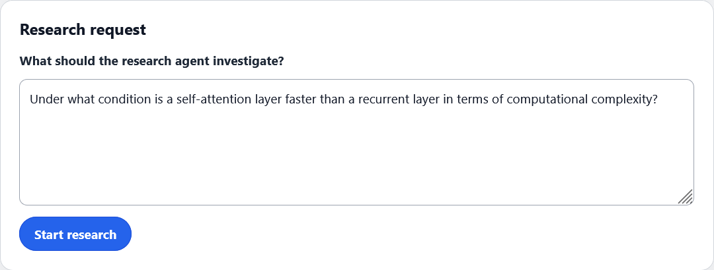
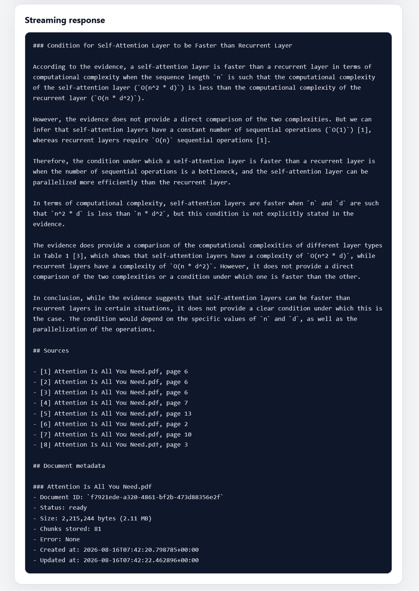
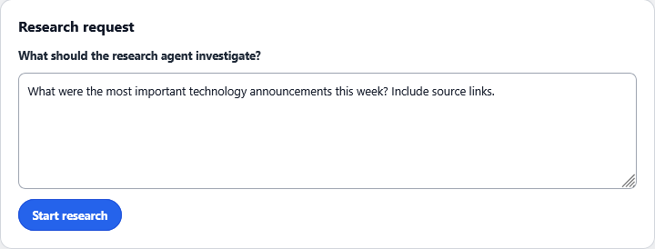
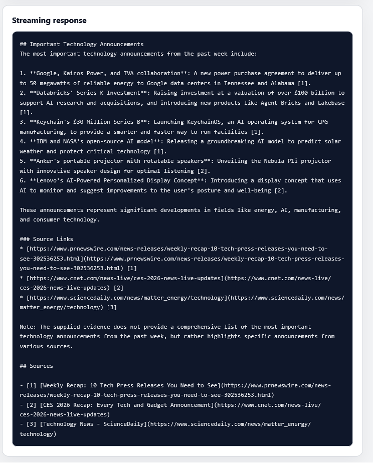

# Application screenshots

## 1. Document upload and queueing

Users can upload one or more PDF files. Each accepted document is placed in the processing queue, and the interface displays its current status while background processing is underway.

## 2. Searching uploaded documents

After a document reaches the `ready` state, the research agent searches its indexed chunks in Weaviate and streams a cited response to the interface.

## 3. External web-search fallback

If the uploaded documents do not provide enough evidence, the research agent can use Tavily to find relevant web sources and include their links in the answer.

